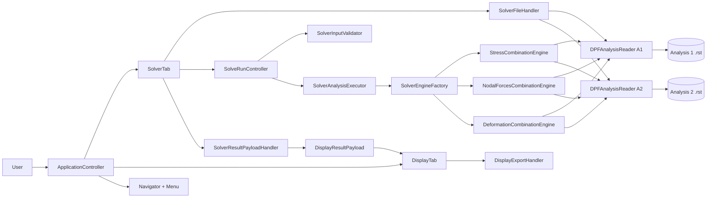
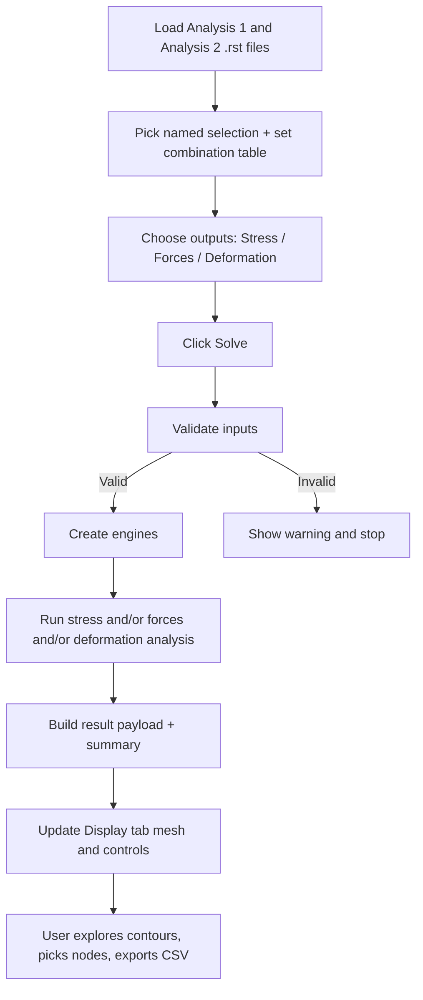
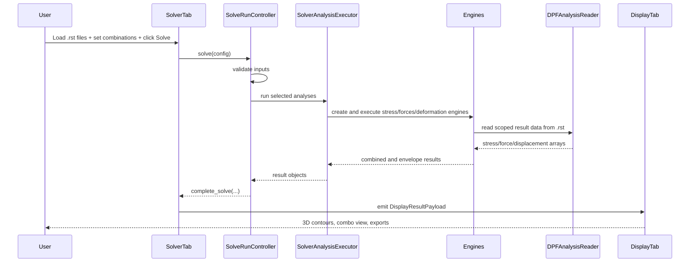

# MARS-SC Architecture (Plain English)

## Purpose of this document
This file explains how the MARS-SC codebase is put together, in practical terms.
It is meant for engineers who want to understand where things live and how data moves through the app.

## What this app does
MARS-SC is a desktop tool that:
- reads two ANSYS `.rst` result files,
- applies user-defined linear combinations,
- computes envelopes (max/min across combinations),
- supports stress, nodal forces, and deformation outputs,
- shows results in a 3D view,
- exports CSV outputs.

In short: it helps users combine and review many load-step combinations without doing the process manually.

## Big picture
The app is split into clear parts:

- `src/ui`: windows, tabs, dialogs, and interaction handlers.
- `src/solver`: numerical engines that combine stress/forces/deformation.
- `src/file_io`: reading `.rst` files and importing/exporting CSV or JSON data.
- `src/core`: shared data models, plasticity prep helpers, and visualization helpers.
- `src/utils`: constants, tooltip text, and style constants.

The design idea is simple:
- UI gathers inputs and triggers work.
- Solver does calculations.
- File I/O owns reading/writing formats.
- Core models keep data contracts stable between modules.

## Visual architecture maps
If your Markdown viewer supports Mermaid, these diagrams will render automatically.

### 1) Component map (who talks to whom)

### 2) Solve pipeline (happy path)

### 3) One solve run as a sequence

## Startup flow
1. `mars_sc_entry.py` prepares import paths (especially for packaged builds).
2. `src/main.py` starts Qt and creates `ApplicationController`.
3. `ApplicationController` creates:
- `SolverTab` (input + solving)
- `DisplayTab` (3D viewing + export)
4. Signals connect the two tabs so solve results can be visualized immediately.

## Main runtime flow
### 1) User loads RST files
- `SolverFileHandler` handles file dialogs.
- `RSTLoaderThread` loads metadata in the background (keeps UI responsive).
- `DPFAnalysisReader` reads analysis metadata from each `.rst`.
- `AnalysisData` is stored in the solver tab state.

### 2) User configures scope and combinations
- Named selection source and selection are handled in `solver_named_selection_handler`.
- Combination table data is parsed/validated via `CombinationTableParser`.
- UI state and output options are managed by dedicated handlers.

### 3) User clicks Solve
- `SolveRunController` coordinates the full solve lifecycle:
- validate inputs,
- choose which analyses to run,
- route progress and error handling,
- finalize UI state.

### 4) Engines perform calculations
`SolverAnalysisExecutor` creates engines through `SolverEngineFactory`:
- `StressCombinationEngine`
- `NodalForcesCombinationEngine`
- `DeformationCombinationEngine`

These engines pull data through `DPFAnalysisReader` and compute combination results.

Important behavior in stress solve:
- can run full mode or memory-friendly chunked mode,
- can run single-node history mode,
- can apply scalar plasticity correction (Neuber/Glinka) for von Mises workflows.

### 5) Results are summarized, exported, and sent to Display
- `SolverResultSummaryHandler` logs key result summaries and writes envelope CSV outputs.
- `SolverResultPayloadHandler` builds a `DisplayResultPayload` with mesh and metadata.
- `SolverTab` emits payload to `DisplayTab`.

### 6) Display tab renders and lets user inspect/export
- `DisplayTab` stores the incoming payload and updates PyVista view.
- Contour behavior is synchronized by `display_contour_sync_handler`.
- Export buttons call `DisplayExportHandler`.
- Node picking can trigger history solves in the solver tab.
- On-demand recompute is supported for selected stress combinations.

## Data contracts (why modules stay decoupled)
`src/core/data_models.py` holds the main dataclasses used across layers:
- `AnalysisData`
- `CombinationTableData`
- `SolverConfig`
- `CombinationResult`
- `NodalForcesResult`
- `DeformationResult`
- plasticity and material data models

Because these models are shared, UI and solver code can evolve without breaking each other as long as the model fields stay consistent.

## Key rules in this codebase
These rules appear in multiple modules and shape architecture decisions:

1. Reader-first access to `.rst` files
- `DPFAnalysisReader` is the integration boundary for DPF operations.
- Solver and UI code should reuse it instead of reimplementing DPF chains.

2. Named-selection precedence
- If the same named selection exists in both analyses, Analysis 1 (base) takes precedence for scoping.

3. Unit normalization boundaries
- Stress is normalized to MPa near extraction.
- Displacement is normalized to mm near extraction.
- Force units are preserved from source results.

4. Memory-aware processing
- Large stress jobs can switch to chunked processing to reduce RAM pressure.

5. Output availability checks before expensive runs
- Nodal forces and displacement availability are validated before solve execution.

## Folder map
- `src/main.py`: local/dev app entry point.
- `mars_sc_entry.py`: packaged/runtime entry wrapper.
- `src/ui/application_controller.py`: top-level window and tab wiring.
- `src/ui/solver_tab.py`: user input, run trigger, and solver state.
- `src/ui/display_tab.py`: 3D result view and display controls.
- `src/ui/handlers/*`: focused behavior units (validation, file handling, progress, contour sync, export).
- `src/solver/*_engine.py`: heavy compute engines.
- `src/file_io/dpf_reader.py`: ANSYS DPF reader and extraction helpers.
- `src/file_io/exporters.py`: CSV/JSON export helpers.
- `tests/`: regression and behavior tests.

## Testing strategy in practice
The test suite is organized around real behaviors, not only unit-level helpers.
Commonly important regression areas include:
- combination parsing and data models,
- skip-substep behavior,
- real RST combination paths,
- RAM-saving/chunked paths,
- solver UI progress/orchestration,
- display contour policy and mesh-array behavior,
- exporter correctness.

## Where to change what
- Add or change solve orchestration: `solve_run_controller.py`, `solver_analysis_executor.py`.
- Add a new compute path: usually a `src/solver/*_engine.py` module + wiring in executor/factory.
- Change RST extraction behavior: `src/file_io/dpf_reader.py`.
- Change what gets visualized: `solver_result_payload_handler.py` + display handlers.
- Change CSV output format: `src/file_io/exporters.py` and related display/summary handlers.

## Practical architecture summary
MARS-SC uses a handler-driven UI, engine-driven computation, and a single DPF reader boundary.
That split keeps the code understandable:
- UI code focuses on user flow,
- solver code focuses on math and performance,
- file I/O code focuses on format contracts,
- shared data models keep all parts aligned.
